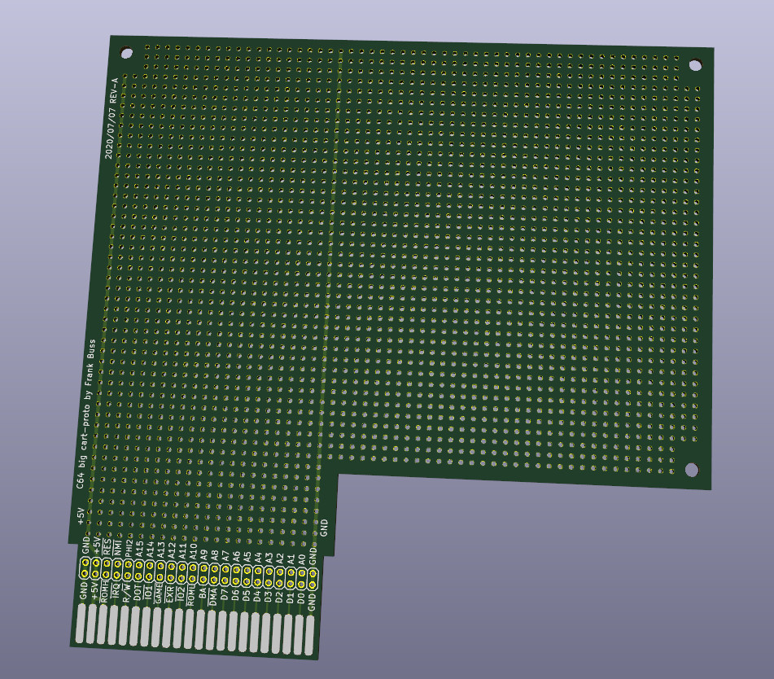

# C64 cartridge port prototype board
This is a prototype board for the C64 cartridge expansion port to build
prototypes, or RAM and ROM extensions.  Board:

See [here](layout.pdf) for the layout in PDF format. The project was done with
KiCad, imported from an old Eagle project.  All KiCad files are available in
this repository. The Gerber files are [here](gerber.zip).

